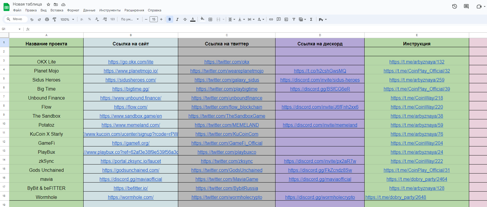

# Ключевые моменты

В 2021 году команда CoinWay начала формирование экосистемы на базе Telegram каналов, постепенно сегментируя направления по категориям активностей из–за увеличения их количества:

1. Канал **CoinWay** – агрегировал такие активности как тестнеты, амбассадорские программы и создание нод.
2. Канал **CoinPlay** – агрегировал активности игрового сектора и начал формировать игровую гильдию.
3. Канал **CoinEarn** – агрегировал активности связанные с AirDrop кампаниями, розыгрышами NFT и квестов схожей тематики.
4. Канал **CoinStudy** – был создан для публикации образовательного контента, оказывая поддержку новым пользователям в изучении сферы блокчейн технологий.
5. Канал **CoinWay News** – был создан для публикации новостей, которые оказывают влияние в блокчейн пространстве.

Спустя несколько месяцев проработки были выявлены слабые места, которые усложняли взаимодействие с пользователями, а именно:

1. Пользователям приходилось следить сразу за несколькими каналами, что снижало фокус внимания.
2. Пользователи пропускали часть активностей, не пролистывая канал выше 3–5 постов, опираясь на мнение, что информация утратила свою актуальность.
3. Пользователям было сложно запомнить все проекты, в которых они принимали участие, из–за чего стали формироваться заметки в блокнотах и гугл таблицы со списками понравившихся проектов.
4. Пользователи пропускали некоторые важные новости проектов, из–за чего теряли свои наработки, не выполнив важные взаимодействия.

Исходя из вышеперечисленных проблем наша команда пришла к формированию собственной **Google Таблицы**, однако она не удовлетворяла наши потребности т.к. имела ограниченный функционал.

<figure><figcaption>
пример Google таблицы с проектами и активностями
</figcaption></figure>

В поисках лучших решений мы пришли к формированию базы данных на платформе **Notion.**

На протяжении нескольких месяцев мы видоизменяли формат, внедряя новые параметры фильтров, отметок и сортировки, чтобы упростить взаимодействие пользователей и облегчить их путь по изучению, выбора проектов и их активностей.

<figure><figcaption>
пример базы данных по проектам и активностям в Notion
</figcaption></figure>

<figure><figcaption>
пример раздела с личными заметками в Notion
</figcaption></figure>

В ходе работы с данным форматом были выявлены следующие проблемы:

1. Многие пользователи не понимали, как пользоваться данной платформой.
2. Взаимодействие вынуждало регулярно переключаться между Telegram каналами и платформой, что требовало большого количества действий и внимания.
3. Появилась потребность в создании пустой копии, которую пользователи использовали для формирования собственного списка любимых проектов, но перенос данных из одной в другую вызывал затруднения, поэтому часть пользователей оставалась на базе Google Таблиц, что привело сразу к нескольким точкам внимания – Telegram, Notion, Google Таблицы.
4. Полноценно базу данных можно было просматривать только с ПК.

После детального рассмотрения всех процессов, командой было принято решение по разработке собственного сайта, который решит вышеперечисленные проблемы и который можно легко и удобно просматривать с любого устройства. \
Однако оставалась очень важная проблема – переход на сайт из Telegram требует дополнительных манипуляций, что снижает показатели конверсии и не обеспечивает должного комфорта.

С появлением возможности создания Telegram Mini Apps (WebApp) все детали встали на свои места, что дало нашей команде возможность полноценно реализовать свою идею, которая прорабатывалась около трех лет. Так началась разработка Mini App – CoinWay.
